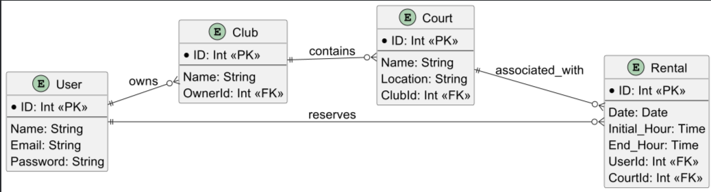

## Introduction

This document contains the relevant design and implementation aspects of LS project's first phase.

## Modeling the database

### Conceptual model ###

The following diagram holds the Entity-Relationship model for the information managed by the system.

We highlight the following aspects:

- Type of each attribute: This is important because in our work we defined each attribute with a class that we created, this was done to make the code more readable and to make it easier to understand the code.
- Cardinality of each relationship: This is important because it allows us to understand how the tables are related to each other and how the information is stored in the database.

The conceptual model has the following restrictions:

#### 1. User
- Each user must have a unique email.
- Each user must have a unique token.
- Passwords must meet basic security standards (minimum length, special character, etc...).

#### 2. Club
- Each club must have a unique name.
- A club must have an owner.

#### 3. Court
- Courts within the same club must have unique names.
- Courts must belong to only one club.

#### 4. Rental
- The start time must be before the end time.
- Rentals must be for available courts only.

### Physical Model ###

Physical model of database: [SQL Schema](../src/main/sql/createSchema.sql)

We highlight the following aspects of this model:

- A `Rental` is considered valid only if the start time precedes the end time.  
- A `Club` with active courts or rentals cannot be deleted.  
- The uniqueness of `User` emails ensures no duplicate accounts can exist.  
- The relationship integrity is maintained through entity constraints (e.g., a `Court` must belong to an existing `Club`).  
- Dates are validated to match the format `YYYY-MM-DD` and must represent real, valid dates.

## Software organization

### Open-API Specification ###

[API Documentation](apiDoc.yaml)

In our Open-API specification, we highlight the following aspects:

- Organized API endpoints for Users, Clubs, Courts, and Rentals
- JWT authentication for secure access
- Clear connections between clubs, courts, and rental bookings
- Consistent data models with input and output schemas
- Standard error handling with appropriate status codes
- Comprehensive endpoint descriptions
- API version tracking (1.0.0)

### Request Details

When a request is made to the API, it goes through the following elements:

1. **WebApi**: The request is first handled by the appropriate controller class which is located in the corresponding webAPI file.This maps the request to the corresponding endpoint.
2. **Service**: The controller then calls the relevant service class, which contains the business logic for processing the request.
3. **Storage**: The service interacts with the storage layer, which is responsible for managing the database operations and data memory.

The relevant classes/functions used internally in a request include for example:

- `rentalWebApi`: Handles requests related to rentals.
- `rentalService`: Contains business logic for rental operations.
- `rentalDataMem/rentalDataPostgres/rentalIStorage`: Manages database interactions for rentals.

### Connection Management

In our application, connection management is handled as follows:

- It was created an environment variable to store the connection string to the database. This allows for easy configuration and management of the database connection.

- Creation: Connections to the PostgresSQL database are created using a Connection object. This object is passed to the DataPostgres classes, which manages database operations.
- Usage: When a request is made that requires database access, the DataPostgres classes uses the connection to execute SQL statements. Prepared statements are used to prevent SQL injection and ensure efficient execution of queries.
- Disposal: Connections are managed externally and should be closed after all database operations are completed to ensure that resources are not leaked

Transaction Scopes:

- Transaction Management: Transactions are managed manually within the DataPostgres classes. Each method that performs database operations ensures that the operations are executed within a transaction.

### Data Access

In our application, the following classes are created to help with data access:  

- RentalDataPostgres: This class handles database operations related to rentals. It is used to fetch rentals information.
- UserDataPostgres: This class handles database operations related to users. It is used to fetch user information.  
- ClubDataPostgres: This class manages database operations related to clubs. It is used to fetch club information.  
- CourtDataPostgres: This class handles database operations related to courts. It is used to fetch court information. 

Non-trivial SQL statements used in the application include:

Insert Rental:  
INSERT INTO rental(date, initDuration, endDuration, usr, court) VALUES(?, ?, ?, ?, ?)

Select Rental by ID:  
SELECT * FROM rental WHERE rid = ?

Select Rentals by User, Court, and Date:  
SELECT * FROM rental WHERE usr = ? AND court = ? AND date = ?

Select Rentals by User:
SELECT * FROM rental WHERE usr = ?

### Error Handling/Processing

The errors are handled in the following way:

- By a try-catch block that is going to call another class that treats the error by their type and returns the exact type in Http error number format (ex: 404, 500, etc.).

## Deployment

We have successfully deployed our site using Render and Docker. The Dockerfile used for the deployment is located in the root directory of our project. The deployment process involves building a Docker image from our Dockerfile and then deploying that image using Render.

### Docker

Docker is a platform that allows us to automate the deployment, scaling, and management of applications. It uses containerization technology to package up an application with all of its dependencies into a standardized unit for software development.

### Password Encryption

We use bcrypt for password encryption. When a player creates an account or changes their password, we hash the password using bcrypt and store the hash in our database. The `Password` class ensures that passwords meet strength requirements.

During login, the entered password is hashed and compared with the stored hash. If they match, access is granted. This method ensures that even if our database is compromised, the actual passwords remain secure.

Bcrypt is a one-way hash function, making it computationally infeasible to reverse the process and obtain the original password from the hash.