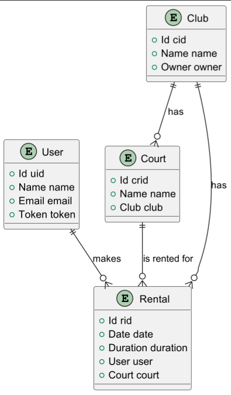

# Phase 1

## Introduction

This document contains the relevant design and implementation aspects of LS project's first phase.

## Modeling the database

### Conceptual model ###

The following diagram holds the Entity-Relationship model for the information managed by the system.

We highlight the following aspects:

- Type of each attribute: This is important because in our work we defined each attribute with a class that we created, this was done to make the code more readable and to make it easier to understand the code.
- Cardinality of each relationship: This is important because it allows us to understand how the tables are related to each other and how the information is stored in the database.

The conceptual model has the following restrictions:

- Data Integrity: We need to ensure that each field is not null, and that the data is consistent with the type of the field.
- Relationship Integrity: We need to ensure that the relationships between the domains are consistent, and that the data is consistent with the relationships.
- Security: We need to ensure that the data is secure and that only authorized users can access the data needing a token that is unique to each user.
- Error handling: We need to ensure that the data is handled correctly and that the user is informed of any errors that may occur.

### Physical Model ###

The physical model has the following tables:
- User: This table stores information about users, including their ID, name, email, and password.
- Club: This table stores information about clubs, including their ID, name.
- Court: This table stores information about courts, including their ID, name, and location.
- Rental: This table stores information about rentals, including their ID, date, start and end time, user ID, and court ID.

We highlight the following aspects of this model:  

- Indexing: Proper indexing of tables to improve query performance.
- Foreign Keys: Use of foreign keys to enforce referential integrity.
- Data Types: Choosing appropriate data types for each column to optimize storage and performance.
- Constraints: Implementing constraints to ensure data validity and integrity.

## Software organization

### Open-API Specification ###

https://app.swaggerhub.com/apis/afonsosantos-d07/courts-api/1.0.0

In our Open-API specification, we highlight the following aspects:

- Organized API endpoints for Users, Clubs, Courts, and Rentals
- JWT authentication for secure access
- Clear connections between clubs, courts, and rental bookings
- Consistent data models with input and output schemas
- Standard error handling with appropriate status codes
- Comprehensive endpoint descriptions
- API version tracking (1.0.0)

### Request Details

When a request is made to the API, it goes through the following elements:

1. **WebApi**: The request is first handled by the appropriate controller class which is located in the corresponding webAPI file.This maps the request to the corresponding endpoint.
2. **Service**: The controller then calls the relevant service class, which contains the business logic for processing the request.
3. **Storage**: The service interacts with the storage layer, which is responsible for managing the database operations and data memory.

The relevant classes/functions used internally in a request include for example:

- `rentalWebApi`: Handles requests related to rentals.
- `rentalService`: Contains business logic for rental operations.
- `rentalDataMem/rentalDataPostgres/rentalIStorage`: Manages database interactions for rentals.

### Connection Management

In our application, connection management is handled as follows:

- It was created an environment variable to store the connection string to the database. This allows for easy configuration and management of the database connection.

- Creation: Connections to the PostgresSQL database are created using a Connection object. This object is passed to the DataPostgres classes, which manages database operations.
- Usage: When a request is made that requires database access, the DataPostgres classes uses the connection to execute SQL statements. Prepared statements are used to prevent SQL injection and ensure efficient execution of queries.
- Disposal: Connections are managed externally and should be closed after all database operations are completed to ensure that resources are not leaked

Transaction Scopes:

- Transaction Management: Transactions are managed manually within the DataPostgres classes. Each method that performs database operations ensures that the operations are executed within a transaction.

### Data Access

In our application, the following classes are created to help with data access:  

- RentalDataPostgres: This class handles database operations related to rentals. It is used to fetch rentals information.
- UserDataPostgres: This class handles database operations related to users. It is used to fetch user information.  
- ClubDataPostgres: This class manages database operations related to clubs. It is used to fetch club information.  
- CourtDataPostgres: This class handles database operations related to courts. It is used to fetch court information. 

Non-trivial SQL statements used in the application include:

Insert Rental:  
INSERT INTO rental(date, initDuration, endDuration, usr, court) VALUES(?, ?, ?, ?, ?)

Select Rental by ID:  
SELECT * FROM rental WHERE rid = ?

Select Rentals by User, Court, and Date:  
SELECT * FROM rental WHERE usr = ? AND court = ? AND date = ?

Select Rentals by User:
SELECT * FROM rental WHERE usr = ?

### Error Handling/Processing

The errors are handled in the following way:

- By a try-catch block that is going to call another class that treats the error by their type and returns the exact type in Http error number format (ex: 404, 500, etc.).

## Critical Evaluation

- Identified Defects: There are known issues with the date handling in rental bookings, which need to be addressed.

Improvements for Next Phase:
- Complete the implementation of more endpoints.
- Improve error handling to provide more detailed error messages.
- Optimize database queries for better performance.
- Enhance security measures, such as implementing rate limiting and improving token management.